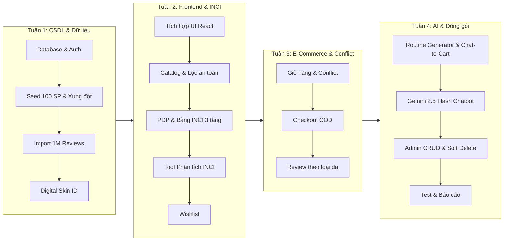

# ĐẶC TẢ PHẠM VI CHỨC NĂNG PHASE 1 (ĐỒ ÁN TỐT NGHIỆP — BEAUTYAI)

> **Mục tiêu:** Hoàn thiện và đóng gói toàn bộ hệ thống BeautyAI trong vòng **1 tháng (4 tuần)** phục vụ bảo vệ đồ án tốt nghiệp.
> **Nguyên tắc phân bổ:** 
> - Ưu tiên tuyệt đối các tính năng USP (Khác biệt hóa & AI da liễu): Digital Skin ID, Allergy Blacklist, INCI Analyzer, Conflict Detector, Routine Builder, Trợ lý Gemini AI.
> - Khai thác tối đa thế mạnh tài nguyên sẵn có: **Dataset 1 triệu review** (lọc review theo loại da) và **UI có sẵn** (Danh sách yêu thích Wishlist).
> - Cắt giảm các tính năng quản trị phức tạp, tích hợp bên thứ ba rườm rà (Zalo OA, tỷ giá đa tệ, email SMTP...) để đưa vào **Phase 2 (Hướng phát triển tương lai trong báo cáo)**.

---

## 1. TÀI KHOẢN & XÁC THỰC (AUTHENTICATION & PROFILE)

### 🟢 Phase 1 — Triển khai cho đồ án:
1. **Đăng ký & Đăng nhập:** Xác thực bằng Email/Mật khẩu (sử dụng JWT hoặc Session).
2. **Đăng xuất:** Hủy phiên làm việc an toàn.
3. **Đổi mật khẩu:** Cho phép người dùng đổi mật khẩu khi đã đăng nhập.
4. **Xem & cập nhật thông tin cá nhân:** Họ tên, số điện thoại, ngày sinh, địa chỉ giao hàng mặc định.
5. **Phân quyền truy cập cơ bản (RBAC):** 
   - Khách vãng lai / Người dùng (`CUSTOMER`).
   - Quản trị viên (`ADMIN`).
   - Middleware chặn truy cập trái phép vào các route bảo vệ (`/admin`, `/profile`, `/checkout`).

### 🔴 Phase 2 — Tạm hoãn sang tương lai:
- *Admin đặt lại mật khẩu cho khách qua email token*: Phase 1 Admin chỉ cần có quyền vô hiệu hóa (deactivate) hoặc hỗ trợ set mật khẩu tạm trực tiếp nếu cần test.
- *Đăng nhập bằng mạng xã hội (Google / Facebook OAuth)*: Không làm kịp và dễ lỗi cấu hình redirect URI trên localhost/demo.

---

## 2. DANH MỤC, TÌM KIẾM & SMART FILTER

### 🟢 Phase 1 — Triển khai cho đồ án:
1. **Duyệt danh mục sản phẩm:** Cây danh mục 2-3 cấp (Chăm sóc da -> Làm sạch -> Sữa rửa mặt / Tẩy trang...).
2. **Tìm kiếm sản phẩm:** Tìm theo tên sản phẩm, tên thương hiệu hoặc từ khóa hoạt chất (ví dụ: gõ "Niacinamide").
3. **Lọc theo Loại da & Khoảng giá:** Lọc sản phẩm phù hợp da dầu, khô, nhạy cảm... và thanh trượt khoảng giá (USD $).
4. **Sắp xếp kết quả:** Theo giá tăng/giảm, đánh giá sao cao nhất, bán chạy/phổ biến.
5. **Hiển thị & xóa bộ lọc:** Danh sách các chip bộ lọc đang áp dụng, có nút xóa từng filter và "Xóa tất cả".
6. **Lọc riêng "An toàn cho da tôi" *(USP)*:** 
   - Công tắc (toggle switch) dành cho user đã đăng nhập và có Digital Skin ID.
   - Khi bật: Tự động loại bỏ toàn bộ sản phẩm chứa thành phần trong **Allergy Blacklist** của user đó và các mỹ phẩm thiếu bảng INCI từ hãng (vẫn giữ dụng cụ vật lý `Tools & Brushes`).

### 🔴 Phase 2 — Tạm hoãn sang tương lai:
- *Lọc theo chứng nhận (Vegan / Cruelty-Free / Clean) & Lọc loại trừ "Free-of" chi tiết:* Tốn rất nhiều công chuẩn hóa dữ liệu từng sản phẩm; chỉ đưa vào danh mục thuộc tính mở rộng ở Phase 2.

---

## 3. TRANG CHI TIẾT SẢN PHẨM (PDP) & PHÂN TÍCH INCI

### 🟢 Phase 1 — Triển khai cho đồ án:
1. **Thông tin cơ bản sản phẩm:** Tên, thương hiệu, hình ảnh, giá bán, mô tả, dung tích, tình trạng kho.
2. **Hiển thị bảng thành phần INCI 3 tầng (Progressive Disclosure):**
   - **Tầng 1 (Kết luận cá nhân hóa):** Hiển thị kết luận dạng chữ (`Good Match`, `Match with Notes`, `Not Suitable — Allergy Alert`) kèm giải thích ngắn gọn và cảnh báo dị ứng.
   - **Tầng 2 (Key Notable Ingredients & Functional Role Groups):** Hiển thị 3–6 chất nổi bật nhất bằng tên thông dụng dễ hiểu (kèm tên gốc INCI và giải thích 1 dòng) + Gom nhóm các chất nền theo vai trò công thức.
   - **Tầng 3 (Full Packaging INCI List):** Thu gọn mặc định trong thanh trượt để tra cứu toàn bộ danh sách INCI theo thứ tự nồng độ.
3. **Kết luận độ phù hợp dạng chữ (Suitability Verdict — Bỏ điểm số `%` & `/5`):** Đồng bộ toàn hệ thống (Catalog, PDP, Wishlist, Analyzer) về kết luận dạng chữ dễ hiểu thay vì con số phần trăm gây nhầm lẫn; ẩn tab INCI với dụng cụ vật lý (`Tools & Brushes`) và thông báo minh bạch `Insufficient INCI Data` với mỹ phẩm thiếu INCI từ hãng (đồng thời loại khỏi bộ lọc `"Safe for me"`).
4. **Cảnh báo dị ứng cá nhân trên PDP *(USP)*:** 
   - Banner màu đỏ nổi bật liệt kê gộp gọn các chất trùng với **Allergy Blacklist** của người dùng: *"Contains ingredients that trigger your personal Allergy Blacklist: a, b, c"*.
5. **Thêm vào giỏ từ PDP:** Chọn số lượng và thêm vào giỏ hàng.
6. **Hướng dẫn sử dụng & Vị trí trong routine theo đúng ngành hàng:** Gợi ý bước AM/PM cho Skincare, hoặc hướng dẫn sử dụng phù hợp cho Fragrance, Makeup, Hair, Tools & Brushes.
7. **Sản phẩm tương tự:** Gợi ý tối đa 4-6 sản phẩm cùng danh mục/công dụng.
8. **Thêm vào Wishlist từ PDP:** Nút bấm thả tim tương tác nhanh kết nối với Danh sách yêu thích.
9. **Kho hình ảnh sản phẩm chuẩn hóa (Local High-Res WebP Assets):**
   - Lưu trữ cục bộ **378+ ảnh sản phẩm thật** độ phân giải cao (800x800px WebP) tại `src/frontend/public/images/products/{product_id}.webp` bao phủ 100% các dòng trọng điểm (The Ordinary 54/54, Drunk Elephant 56/56, Paula's Choice 39/39, Hourglass Ambient 14/14, Rare Beauty Soft Pinch) cùng đợt đầu tiên của Cụm thương hiệu # & A (Anastasia Beverly Hills, Armani Beauty, Algenist, Augustinus Bader, amika...).
   - Đồng bộ trường `image_url` trực tiếp trong Database (PostgreSQL) và Dataset (`products_cleaned.csv`, `products_ready.csv`) trỏ URI tĩnh (`/images/products/{code}.webp`), tuyệt đối không lưu dữ liệu nhị phân/base64 trong database nhằm bảo toàn hiệu năng cao và tận dụng HTTP browser caching.
   - **Phân tích nguyên nhân lỗi ảnh & Giải pháp cào ảnh chuẩn hóa:**
     - *Nguyên nhân cào sai / trùng ảnh trước đây:* (1) Dataset gốc Kaggle Sephora chỉ có `product_id` (dạng `P...`), không chứa link ảnh gốc hay SKU ID của Sephora; (2) Thuật toán gán SKU phỏng đoán (heuristic guessing) và cào ảnh tự động thiếu kiểm chứng dẫn đến sai lệch bản chất sản phẩm (nước hoa ra ảnh son, gift set ra kem nền, cọ ra bảng phấn); (3) Pool ảnh fallback Unsplash cũ chứa các hình không phù hợp (quả cam, mặt spa đắp mặt nạ, vòi sen) và thuật toán hash ngắn khiến sản phẩm cạnh nhau bị trùng ảnh.
     - *Quy chuẩn cào ảnh chính xác (BeautyAI Harvester Protocol):*
       1. Khớp chính xác mã SKU Sephora (`skuId`) thông qua cơ chế Search Grounding danh mục chính hãng (`"{Brand}" "{Product Name}" sephora "skuId"`).
       2. Tải trực tiếp ảnh zoom độ phân giải cao từ CDN Sephora (`https://www.sephora.com/productimages/sku/{sku}-main-zoom.jpg`) kèm HTTP headers chuẩn (`User-Agent` Chrome Desktop và `Referer: https://www.sephora.com/`).
       3. Với các mã hàng phân phối độc quyền ngoài Sephora US (như Paula's Choice EU direct), trích xuất ảnh chuẩn từ CDN chính thức của thương hiệu.
       4. Xử lý chuẩn hóa bằng Pillow: chuyển đổi về kích thước chuẩn 800x800px, định dạng WebP (lossy quality 85), dung lượng tối ưu ~15-40KB/ảnh.
       5. Làm sạch triệt để danh mục fallback: loại bỏ hoàn toàn các ảnh quả cam/khuôn mặt spa, chỉ giữ lại ảnh studio mỹ phẩm tối giản và áp dụng hàm băm ghép chuỗi đa thành phần (`{id}_{name}_{brand}`) để ngăn chặn trùng lặp.

### 🔴 Phase 2 — Tạm hoãn sang tương lai:
- *So sánh sản phẩm (Product Comparison & Compare Drawer):* Tạm hoãn sang Phase 2 để tinh gọn thanh điều hướng và tập trung vào 5 USP cốt lõi.
- *"Vì sao sản phẩm này được gợi ý?" (Modal giải thích trọng số thuật toán):* Thay bằng 1 dòng tooltip/text ngắn gọn.
- *"Thường được mua cùng" (Frequently Bought Together):* Cần thuật toán khai phá giỏ hàng (Apriori/Association Rules), tốn tài nguyên tính toán.

---

## 4. DIGITAL SKIN ID & CẢNH BÁO DỊ ỨNG

### 🟢 Phase 1 — Triển khai cho đồ án (USP Cốt lõi):
1. **Tạo & cập nhật hồ sơ da:** 
   - Chọn loại da chính: `Dầu`, `Khô`, `Hỗn hợp`, `Thường`.
   - Chọn thuộc tính bổ sung: Công tắc `Da nhạy cảm`.
   - Chọn các vấn đề da quan tâm (tối đa 5): `Mụn`, `Thâm nám`, `Lỗ chân lông to`, `Lão hóa`, `Khô bong tróc`...
2. **Quản lý Allergy Blacklist (`FR-SKIN-02`):**
   - Ô tìm kiếm có auto-suggest thành phần từ DB (gõ tiếng Việt hoặc tên INCI đều ra).
   - Thêm chất dị ứng vào danh sách cá nhân dưới dạng thẻ xóa được.
3. **Cảnh báo dị ứng xuyên suốt hệ thống:**
   - Cảnh báo xuất hiện tại: Thẻ sản phẩm ngoài danh mục, trang PDP, mục Giỏ hàng, kết quả Skin Quiz và câu trả lời AI Chatbot.
4. **Gợi ý sản phẩm thay thế an toàn:** Link bấm *"Tìm sản phẩm thay thế"* chuyển hướng đến danh mục lọc các sản phẩm cùng nhóm nhưng không chứa chất dị ứng.

### 🔴 Phase 2 — Tạm hoãn sang tương lai:
- *Xem lại lịch sử thay đổi hồ sơ da*: Không cần thiết cho mục đích demo đồ án.
- *Xóa hồ sơ da*: Chỉ cần hỗ trợ cập nhật đè (update) lại thông tin là đủ.
- *Kiểm soát việc chia sẻ hồ sơ với trợ lý AI*: Mặc định gửi thông tin hồ sơ da cho AI để tư vấn tốt nhất.

---

## 5. DIGITAL SKIN ID 1 CHẠM & ROUTINE BUILDER (CHAT-TO-CART)

### 🟢 Phase 1 — Triển khai cho đồ án (USP Cốt lõi):
1. **Thiết lập Digital Skin ID 1 chạm (30 giây) theo thứ tự y khoa:**
   - Bước 1 (Cơ địa nền tảng): Chọn loại da (`Oily`, `Dry`, `Combination`, `Normal`, `Sensitive`).
   - Bước 2 (Vùng cấm kỵ an toàn): Khai báo hoặc chọn nhanh các chất trong **Allergy Blacklist** (`Alcohol Denat`, `Fragrance`, `Paraben`, `Sulfate`...).
   - Bước 3 (Nhu cầu cải thiện & Ngân sách): Chọn vấn đề da ưu tiên (`Acne`, `Aging`, `DarkSpots`, `Pores`, `Sensitivity`, `Dehydration`), mục tiêu chính và mức ngân sách (`Low`, `Medium`, `High`).
2. **Tính toán gợi ý theo thuật toán phân tầng (`RoutineService`):**
   - Lọc danh mục phù hợp -> Khớp loại da -> Loại trừ tuyệt đối sản phẩm dính Allergy Blacklist -> Kiểm tra 0 xung đột hoạt chất nội bộ qua 12 quy tắc y khoa -> Chọn sản phẩm tối ưu trong ngân sách.
3. **Hiển thị Routine Builder AM/PM trực quan (`/routines`):**
   - **AM (Buổi sáng):** Làm sạch -> Cân bằng/Chống oxy hóa -> Dưỡng ẩm -> **Chống nắng (Bắt buộc)**.
   - **PM (Buổi tối):** Làm sạch kép -> Đặc trị chuyên sâu -> Kem dưỡng phục hồi ban đêm.
4. **Giải thích lý do đề xuất & Kiểm tra xung đột tự động:** Nêu rõ công năng từng bước và đảm bảo các bước trong cùng buổi không chứa hoạt chất kỵ nhau.
5. **Chat-to-Cart *(Tính năng Wow)*:** Nút bấm *"Thêm toàn bộ Routine vào giỏ hàng"* (tự động đưa trọn bộ sản phẩm của chu trình vào giỏ chỉ trong 1 click).
6. **Lưu & Quản lý routine cá nhân:** Lưu chu trình vào bảng `saved_routines` (`Morning`, `Night`, `Treatment`) để xem lại hoặc xóa trong hồ sơ cá nhân.

### 🔴 Phase 2 — Tạm hoãn sang tương lai:
- *Bài trắc nghiệm chẩn đoán da đa tầng nâng cao & so sánh với routine cũ theo dòng thời gian.*
- *Xuất routine ra file PDF / chia sẻ lên mạng xã hội.*

---

## 6. CÔNG CỤ PHÂN TÍCH THÀNH PHẦN (INCI ANALYZER)

### 🟢 Phase 1 — Triển khai cho đồ án:
1. **Yêu cầu Đăng nhập (Blurred Preview Gate) & Thiết lập nhanh Skin ID 30 giây:**
   - Cả 2 tab (*Formula Breakdown* & *Skin Type Guide*) yêu cầu đăng nhập để cá nhân hóa theo hồ sơ da (khách chưa đăng nhập sẽ thấy giao diện phân tích làm mờ kèm lời mời đăng nhập).
   - Nếu đã đăng nhập nhưng chưa hoàn tất Skin ID, hệ thống bật popup thiết lập nhanh trong 30 giây (`SkinIdQuickModal`).
2. **Tự động nhận diện 7 vùng chăm sóc (Target Care Area) & Dán bảng thành phần bất kỳ:**
   - Hỗ trợ 7 vùng chăm sóc (`Face`, `Eye Area`, `Lips`, `Hair & Scalp`, `Bath & Body`, `Fragrance`, `Nails & Cuticles`) từ 9 ngành hàng và 62 danh mục con.
   - Bóc tách chuỗi INCI và hiển thị theo cấu trúc **3 tầng** (Verdict cá nhân hóa ➔ 3–6 Key Notable Ingredients + Functional Role Groups ➔ Full Packaging INCI thu gọn).
3. **Phân biệt thông minh Hương liệu & Cồn béo + Đối chiếu Allergy Blacklist:**
   - Không báo nhầm chiết xuất thực vật dịu nhẹ (`Rosa Damascena Flower Water`, `Vanilla`, `Chamomile`) hay cồn béo dưỡng ẩm (`Cetearyl Alcohol`, `Cetyl Alcohol`) là chất gây kích ứng.
   - Cảnh báo gộp gọn các chất trùng với **Allergy Blacklist** của người dùng (`"Contains ingredients that trigger your personal Allergy Blacklist: a, b, c"`).

### 🔴 Phase 2 — Tạm hoãn sang tương lai:
- *Kiểm chứng tuyên bố tiếp thị trên bao bì (Marketing Claim Check) & Từ điển bách khoa chi tiết dạng Wikipedia.*

---

## 7. SMART CONFLICT DETECTOR (PHÁT HIỆN XUNG ĐỘT HOẠT CHẤT)

### 🟢 Phase 1 — Triển khai cho đồ án (USP Cốt lõi):
1. **Phát hiện xung đột trong giỏ hàng:**
   - Hệ thống tự động quét các sản phẩm đang có trong giỏ hàng.
   - Nếu giỏ hàng đồng thời có 2 sản phẩm chứa cặp hoạt chất kỵ nhau (Ví dụ: `Retinol` + `AHA/BHA`, `Benzoyl Peroxide` + `Retinoid`...), lập tức kích hoạt cảnh báo.
2. **Hiển thị giải thích & Phương án xử lý cụ thể:**
   - Cảnh báo viền vàng/cam kèm giải thích: *"Sản phẩm A chứa BHA và Sản phẩm B chứa Retinol khi dùng cùng lúc có thể gây kích ứng hoặc bào mòn da"*.
   - Đưa ra hướng xử lý: *"Khuyên dùng: Dùng BHA vào tối thứ 2-4-6, Retinol vào tối thứ 3-5-7"* hoặc *"Chia buổi Sáng/Tối"*.
3. **Không chặn quyền quyết định mua hàng:** Khách hàng vẫn có quyền tick xác nhận *"Tôi đã hiểu cảnh báo"* và tiếp tục thanh toán bình thường.
4. **Phát hiện xung đột trong Routine Builder:** Áp dụng kiểm tra chéo tự động ngay khi sinh ra Routine gợi ý.

### 🔴 Phase 2 — Tạm hoãn sang tương lai:
- *Kiểm tra xung đột với sản phẩm khách đang dùng ở nhà:* Quy trình nhập liệu quá phức tạp cho người dùng trong giai đoạn đầu.
- *Giao diện Admin tạo mới quy tắc xung đột:* **Giải pháp cho Phase 1:** Seed cứng 10-15 bộ quy tắc xung đột khoa học phổ biến nhất vào CSDL hoặc file JSON config.

---

## 8. SO SÁNH SẢN PHẨM (CHUYỂN SANG PHASE 2)

### 🔴 Phase 2 — Tạm hoãn sang tương lai:
- **Thêm sản phẩm vào khay so sánh (Compare Drawer/Bar)** & **Bảng so sánh chi tiết (Side-by-side table):** Đã thống nhất chuyển sang Phase 2 nhằm tinh gọn thanh điều hướng và tập trung nguồn lực cho 5 tính năng USP cốt lõi ở Phase 1.
- *Tự động đề xuất sản phẩm đối trọng tương đương để so sánh.*

---

## 9. DANH SÁCH YÊU THÍCH (WISHLIST) (ĐÃ CÓ SẴN UI FRONTEND)

### 🟢 Phase 1 — Triển khai cho đồ án (Khai thác UI có sẵn):
1. **Thêm / Bỏ yêu thích:** Bấm icon trái tim trên thẻ sản phẩm (Catalog) hoặc trang chi tiết (PDP).
2. **Trang danh sách yêu thích (`/wishlist`):** Xem toàn bộ các sản phẩm đã lưu, hiển thị giá hiện tại và tình trạng còn/hết hàng.
3. **Chuyển nhanh vào giỏ hàng:** Nút "Thêm vào giỏ" ngay trên từng thẻ sản phẩm trong trang Wishlist.
4. **Xóa khỏi Wishlist:** Xóa từng sản phẩm hoặc nút "Xóa tất cả".

### 🔴 Phase 2 — Tạm hoãn sang tương lai:
- *Tự động gửi email/thông báo đẩy khi sản phẩm trong Wishlist giảm giá hoặc có hàng trở lại.*

---

## 10. GIỎ HÀNG & THANH TOÁN (CART & CHECKOUT)

### 🟢 Phase 1 — Triển khai cho đồ án:
1. **Xem giỏ hàng:** Trang giỏ hàng chuẩn (`/cart`) và khay `CartDrawer` hiển thị danh sách sản phẩm, hình ảnh, đơn giá, số lượng, thành tiền.
2. **Thao tác giỏ hàng:** Tăng/giảm số lượng, xóa sản phẩm, dọn sạch giỏ (`Clear Bag`).
3. **Tích hợp cảnh báo xung đột:** Hiển thị khối cảnh báo xung đột hoạt chất nổi bật ngay đầu giỏ hàng (nếu có) kèm checkbox xác nhận đã hiểu khuyến cáo chia lịch sử dụng.
4. **Luồng Checkout COD:**
   - Form nhập địa chỉ nhận hàng, số điện thoại, ghi chú giao hàng.
   - Phương thức thanh toán: **COD (Thanh toán khi nhận hàng)**.
5. **Tạo đơn hàng & Trang kết quả (Thank You page):** Tạo mã đơn hàng duy nhất (`BA-YYYYMMDD-XXXX`), lưu thông tin vào DB và hiển thị tóm tắt đơn vừa đặt.
6. **Lịch sử đơn hàng của tôi:** Người dùng xem lại các đơn hàng đã đặt và trạng thái đơn (`Pending`, `Delivering`, `Completed`).

### 🔴 Phase 2 — Tạm hoãn sang tương lai:
- *Mã giảm giá (Voucher / Coupon) & Hệ thống Voucher đa tầng.*
- *Khách tự hủy đơn hàng / Mua lại đơn cũ.*
- *Gửi Email xác nhận đơn hàng qua SMTP.*

---

## 11. TRỢ LÝ AI (AI SKINCARE ASSISTANT — LUMI)

### 🟢 Phase 1 — Triển khai cho đồ án (USP Cốt lõi):
1. **Giao diện Tư vấn Chuyên gia AI (`/expert-consult`):** Trang tư vấn trực quan có thẻ sản phẩm tương tác trực tiếp với nút *"Add to Cart"* ngay trong khung chat.
2. **Kết nối mô hình AI (Google Gemini 2.5 Flash + Scientific Rule-Based Fallback):** Sử dụng model `gemini-2.5-flash` qua `GeminiSkincareProvider` (tầng Infrastructure Adapter) với độ trễ thấp, kèm cơ chế dự phòng dựa trên bộ quy tắc khoa học (Rule-based Fallback) vận hành mượt mà ngay cả khi offline hoặc hết quota API.
3. **Grounding dữ liệu sản phẩm:** AI được nạp ngữ cảnh danh mục sản phẩm còn hàng của sàn (giá chuẩn USD `$`) để khi tư vấn chu trình, AI sẽ giới thiệu chính xác các sản phẩm đang có bán trên web kèm thẻ sản phẩm, giá bán và nút mua nhanh.
4. **Cá nhân hóa theo hồ sơ da:** AI tự động đọc Digital Skin ID của người dùng (nếu đã đăng nhập) để chào hỏi và loại bỏ 100% các sản phẩm chứa chất trong **Allergy Blacklist** của họ.
5. **System Prompt kiểm soát an toàn y khoa (Clinical Guardrails):**
   - Đóng vai trò chuyên viên tư vấn mỹ phẩm & chăm sóc da khoa học.
   - Tuyệt đối không chẩn đoán hoặc kê đơn cho bệnh da liễu nặng (như chàm bội nhiễm, vảy nến, viêm da mủ, nhiễm nấm); khi gặp từ khóa bệnh lý lâm sàng, AI lịch sự khuyên người dùng đến bệnh viện khám bác sĩ chuyên khoa da liễu.
   - Ngăn chặn các câu hỏi ngoài phạm vi làm đẹp (Prompt guardrail).

### 🔴 Phase 2 — Tạm hoãn sang tương lai:
- *Kiến trúc phân tầng phức tạp (Tầng 1 rules cứng -> Tầng 2 LLM -> Tầng 3 Zalo).*
- *Chuyển tiếp hội thoại sang Zalo OA (đã thống nhất bỏ).*
- *Lưu và phân tích lịch sử hội thoại nhiều phiên / Đánh giá chất lượng Like-Dislike.*

---

## 12. ĐÁNH GIÁ & NỘI DUNG CỘNG ĐỒNG (KHAI THÁC 1 TRIỆU DATASET)

### 🟢 Phase 1 — Triển khai cho đồ án (Thế mạnh dữ liệu lớn):
1. **Xem danh sách đánh giá trên trang sản phẩm (PDP):**
   - Hiển thị điểm số trung bình (sao 1-5) và biểu đồ phân bổ số lượng đánh giá theo sao.
   - Hiển thị danh sách review thực tế từ tập dữ liệu 1.09 triệu records (truy vấn siêu tốc < 20ms nhờ chỉ mục kép B-Tree `idx_reviews_product_skin`).
2. **Lọc đánh giá theo Loại da & Vấn đề da *(Tính năng cực kỳ giá trị)*:**
   - Người dùng có thể lọc: *"Chỉ xem đánh giá từ những người có DA DẦU (`Oily`)"*, *"DA KHÔ (`Dry`)"*, *"DA HỖN HỢP (`Combination`)"*, *"DA THƯỜNG (`Normal`)"*.
   - Giúp khách hàng xem đúng trải nghiệm của người có cơ địa tương đồng.
3. **"Người có làn da giống bạn nói gì" (Banner cá nhân hóa 1 chạm):**
   - Nếu user đã có Digital Skin ID, trang PDP hiển thị nút lọc 1 chạm và ưu tiên hiển thị các review của nhóm người dùng có cùng loại da.
4. **Viết đánh giá cho sản phẩm:**
   - Form cho phép khách hàng gửi số sao, nhận xét và chọn loại da của mình lúc đánh giá (`POST /api/v1/products/{id}/reviews`).

### 🔴 Phase 2 — Tạm hoãn sang tương lai:
- *Hệ thống bình chọn đánh giá hữu ích (Upvote/Helpful).*
- *Kiểm duyệt đánh giá bằng AI (phát hiện spam/từ ngữ phản cảm tự động).*

---

## 13. QUẢN TRỊ SÀN (ADMIN CONSOLE & PRODUCT CRUD HOÀN CHỈNH)

### 🟢 Phase 1 — Triển khai cho đồ án:
1. **Bảo mật phân quyền & Khởi tạo tự động (`[Authorize(Roles = "Admin")]` & `AdminBootstrapper`):**
   - Toàn bộ API `/api/v1/admin/*` được bảo vệ nghiêm ngặt bởi role `Admin`.
   - Tự động khởi tạo hoặc nâng cấp tài khoản Admin từ biến môi trường (`ADMIN_EMAIL`, `ADMIN_PASSWORD`) với băm mật khẩu PBKDF2 (600.000 vòng lặp).
2. **Bảng điều khiển tổng quan & Phân tích dữ liệu thật (`Analytics & Charts`):**
   - 4 thẻ KPI chính: Tổng số sản phẩm, tổng đơn hàng, tổng doanh thu (USD `$`), đơn hàng chờ xử lý.
   - Thống kê trực tiếp trên 100% dữ liệu thật trong PostgreSQL: Top 10 sản phẩm theo tổng lượt đánh giá & điểm sao thực tế, biểu đồ phân bố theo Danh mục, Thương hiệu, Phân khúc giá và Điểm đánh giá trên toàn bộ 8.494 sản phẩm.
3. **Quản lý sản phẩm trọn vòng đời (`Product Catalog CRUD` & Soft Delete — `ADR-014`):**
   - Tìm kiếm nhanh (gõ từ khóa nhấn `Enter`), lọc theo Thương hiệu, Danh mục, Trạng thái bán (`Active`, `Draft`, `Discontinued`) và phân trang.
   - Thêm mới & Chỉnh sửa sản phẩm qua `ProductFormModal`: cập nhật giá USD (`$`), tồn kho, dung tích, loại da mục tiêu, hình ảnh và chuỗi thành phần INCI (tự động bóc tách và đồng bộ lại bảng `product_ingredients`).
   - **Ngừng bán (Soft Delete — `DELETE /api/v1/admin/products/{id}`):** Chuyển `selling_status = Discontinued`, ẩn khỏi Catalog/PDP khách hàng và chặn đặt mua mới nhưng bảo toàn 100% đánh giá (`reviews`) và đơn hàng lịch sử (`order_items`).
   - **Khôi phục 1 chạm (`PATCH /api/v1/admin/products/{id}/restore`):** Mở bán lại sản phẩm về trạng thái `Active` giữ nguyên ID và lịch sử.
4. **Quản lý đơn hàng COD (`COD Orders`):** Xem danh sách đơn hàng kèm cảnh báo xung đột đã xác nhận, đổi trạng thái đơn (`Pending` -> `Delivering` -> `Completed` / `Cancelled`).

### 🔴 Phase 2 — Tạm hoãn sang tương lai:
- *Xuất báo cáo doanh thu ra file Excel.*
- *Quản lý cấu hình tỷ giá đa tiền tệ USD/VND (Phase 1 chốt toàn bộ hệ thống chạy chuẩn 1 loại tiền tệ là USD `$` đồng bộ với Sephora dataset).*
- *Nhật ký kiểm toán (Audit log ghi nhận thao tác của admin).*
- *Giao diện xem lại và gắn nhãn các phiên hội thoại AI Chatbot.*

---

## 14. TRANG NỘI DUNG TĨNH & HỖ TRỢ (STATIC CONTENT)

### 🟢 Phase 1 — Triển khai cho đồ án:
1. **Trang Trung tâm hỗ trợ & FAQ (`/support`):** Các câu hỏi thường gặp về cách tra cứu thành phần INCI, thiết lập Digital Skin ID, thanh toán COD và giao hàng.
2. **Phương pháp đánh giá độ phù hợp (`Suitability Verdict`) & Thuật toán đề xuất:** Giải thích minh bạch về nguyên lý đối chiếu thành phần INCI 3 tầng theo cơ địa da cá nhân (tuân thủ bất biến **INV-01**: tuyệt đối không chấm điểm `SafetyScore` chung chung).
3. **Chính sách bảo mật & Điều khoản sử dụng:** Nội dung khẳng định tôn trọng dữ liệu nhạy cảm (Digital Skin ID & Allergy Blacklist) của người dùng.
4. **Trang 404 & Trang thông báo lỗi thân thiện.**

### 🔴 Phase 2 — Tạm hoãn sang tương lai:
- *Hệ thống chuông thông báo In-App (Notification center).*
- *Hệ thống form gửi vé hỗ trợ (Ticket support).*

---

# KẾ HOẠCH HÀNH ĐỘNG 4 TUẦN (SPRINT ROADMAP)

```mermaid
flowchart LR
    subgraph W1["Tuần 1: CSDL & Dữ liệu"]
        T11["Database & Auth"] --> T12["Seed 100 SP & Xung đột"] --> T13["Import 1M Reviews"] --> T14["Digital Skin ID"]
    end
    subgraph W2["Tuần 2: Frontend & INCI"]
        T21["Tích hợp UI React"] --> T22["Catalog & Lọc an toàn"] --> T23["PDP & Bảng INCI 3 tầng"] --> T24["Tool Phân tích INCI"] --> T25["Wishlist"]
    end
    subgraph W3["Tuần 3: E-Commerce & Conflict"]
        T31["Giỏ hàng & Conflict"] --> T32["Checkout COD"] --> T33["Review theo loại da"]
    end
    subgraph W4["Tuần 4: AI & Đóng gói"]
        T41["Routine Generator & Chat-to-Cart"] --> T42["Gemini 2.5 Flash Chatbot"] --> T43["Admin CRUD & Soft Delete"] --> T44["Test & Báo cáo"]
    end
    W1 --> W2 --> W3 --> W4
```

### Chi tiết phân bổ công việc theo tuần:

- **Tuần 1: Nền tảng Backend, CSDL & Dữ liệu lớn (Data Foundation)**
  - Thiết kế 10 bảng CSDL PostgreSQL 17 tinh gọn (chuẩn hóa tiền tệ USD `$` và mã sản phẩm Sephora `code`).
  - Hoàn thành Auth (Đăng ký, Đăng nhập PBKDF2 + JWT, Profile, Digital Skin ID thống nhất, Allergy Blacklist).
  - Chuẩn bị dữ liệu: Nạp 8.494 sản phẩm Sephora kèm bảng thành phần INCI và 12 quy tắc xung đột hoạt chất; nạp 1.09 triệu đánh giá vào DB (tối ưu B-Tree index trên cột `(product_id, skin_type)` truy vấn < 20ms).
- **Tuần 2: Ghép UI có sẵn & Xây dựng các tính năng INCI Cốt lõi**
  - Xây dựng trang Danh mục sản phẩm với bộ lọc theo loại da và công tắc *"An toàn cho da tôi"*.
  - Xây dựng trang chi tiết sản phẩm (PDP): Bảng INCI 3 tầng, kết luận `Suitability Verdict` dạng chữ, cờ cảnh báo đỏ nếu trùng chất trong Allergy Blacklist.
  - Làm trang Công cụ Phân tích INCI chuyên sâu theo 7 vùng chăm sóc (Blurred Preview Gate + Skin ID 30 giây).
  - Hoàn thiện trang **Danh sách yêu thích (Wishlist)** (So sánh sản phẩm đã chuyển sang Phase 2).
- **Tuần 3: Giỏ hàng, Phát hiện xung đột, Thanh toán & Review**
  - Làm trang Giỏ hàng và thuật toán **Smart Conflict Detector** (quét 12 cặp kỵ nhau, cảnh báo viền cam kèm hướng dẫn chia lịch).
  - Luồng Thanh toán COD -> Tạo đơn (`BA-YYYYMMDD-XXXX`) -> Lịch sử đơn hàng.
  - Hiển thị danh sách đánh giá tại trang PDP có bộ lọc theo Loại da của người đánh giá (tận dụng dataset 1.09M reviews).
- **Tuần 4: AI Skincare Assistant, Routine Builder, Admin CRUD & Tổng duyệt**
  - Thiết lập Digital Skin ID 1 chạm -> Tự động sinh Routine AM/PM (`/routines`) -> Nút bấm **Chat-to-Cart** thêm cả bộ vào giỏ.
  - Tích hợp Trợ lý AI Lumi (`Gemini 2.5 Flash` + Rule-based Fallback) tư vấn làm đẹp, cá nhân hóa theo Skin ID, rào chắn y khoa và grounding sản phẩm trong shop.
  - Trang Admin Console (`/admin`): Thống kê dữ liệu thật, Product CRUD hoàn chỉnh (Thêm/Sửa/Tìm kiếm/Lọc/Ngừng bán Soft Delete `Discontinued`/Khôi phục `Restore`) và quản lý trạng thái đơn hàng COD.
  - Kiểm thử toàn bộ kịch bản thuyết trình từ đầu đến cuối (12/12 Architecture Tests & 46/46 Unit Tests XANH), chuẩn bị slide và tài liệu báo cáo.
